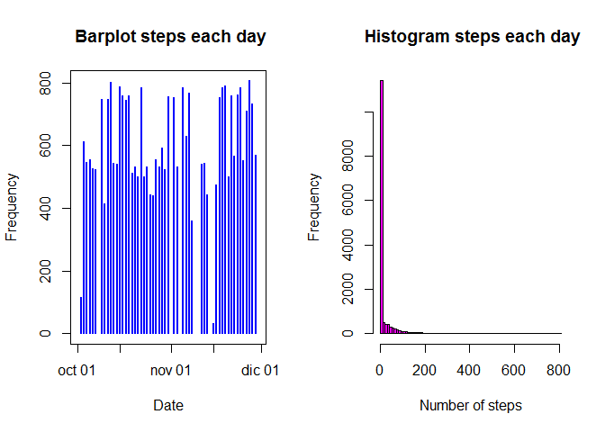
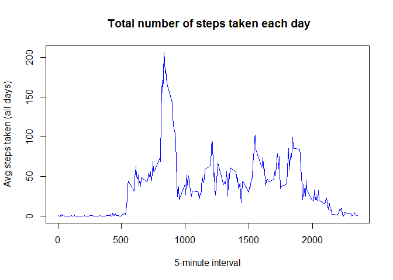
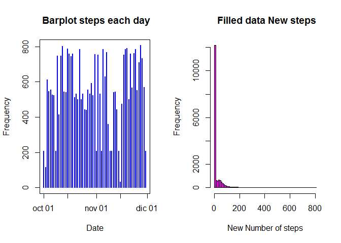
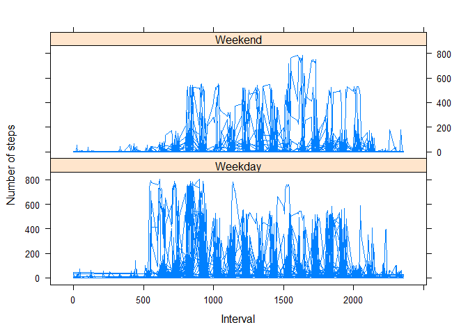

# Reproducible Research: Peer Assessment 1
jlaurensa  


## Loading and preprocessing the data

```r
setwd("~/Coursera/Data_Science/Reproducible_Research/Peer_Assign_1/master")
Dataset <- read.table("activity.csv", header = TRUE, sep = ",", dec = ",")
```

## What is mean total number of steps taken per day?  
### 1. Make a histogram of the total number of steps taken each day

```r
Dataset$date <- as.Date(Dataset$date)

par(mfrow = c(1,2)) 
plot(Dataset$date, Dataset$steps, type = "h", col = "blue", lwd = "2",
             main = " Barplot steps each day", xlab = "Date", ylab = "Frequency" )
hist(Dataset$steps, breaks = 100, col = "magenta", main = " Histogram steps each day", xlab = "Number of steps", ylab = "Frequency")
```

 

### 2. Calculate and report the mean and median of steps taken per day

```r
library(plyr)
meanmedian <- ddply(Dataset,.(date), summarize, mean=mean(steps), median=median(steps))
meanmedian
```

```
##          date    mean median
## 1  2012-10-01      NA     NA
## 2  2012-10-02  0.4375      0
## 3  2012-10-03 39.4167      0
## 4  2012-10-04 42.0694      0
## 5  2012-10-05 46.1597      0
## 6  2012-10-06 53.5417      0
## 7  2012-10-07 38.2465      0
## 8  2012-10-08      NA     NA
## 9  2012-10-09 44.4826      0
## 10 2012-10-10 34.3750      0
## 11 2012-10-11 35.7778      0
## 12 2012-10-12 60.3542      0
## 13 2012-10-13 43.1458      0
## 14 2012-10-14 52.4236      0
## 15 2012-10-15 35.2049      0
## 16 2012-10-16 52.3750      0
## 17 2012-10-17 46.7083      0
## 18 2012-10-18 34.9167      0
## 19 2012-10-19 41.0729      0
## 20 2012-10-20 36.0938      0
## 21 2012-10-21 30.6285      0
## 22 2012-10-22 46.7361      0
## 23 2012-10-23 30.9653      0
## 24 2012-10-24 29.0104      0
## 25 2012-10-25  8.6528      0
## 26 2012-10-26 23.5347      0
## 27 2012-10-27 35.1354      0
## 28 2012-10-28 39.7847      0
## 29 2012-10-29 17.4236      0
## 30 2012-10-30 34.0938      0
## 31 2012-10-31 53.5208      0
## 32 2012-11-01      NA     NA
## 33 2012-11-02 36.8056      0
## 34 2012-11-03 36.7049      0
## 35 2012-11-04      NA     NA
## 36 2012-11-05 36.2465      0
## 37 2012-11-06 28.9375      0
## 38 2012-11-07 44.7326      0
## 39 2012-11-08 11.1771      0
## 40 2012-11-09      NA     NA
## 41 2012-11-10      NA     NA
## 42 2012-11-11 43.7778      0
## 43 2012-11-12 37.3785      0
## 44 2012-11-13 25.4722      0
## 45 2012-11-14      NA     NA
## 46 2012-11-15  0.1424      0
## 47 2012-11-16 18.8924      0
## 48 2012-11-17 49.7882      0
## 49 2012-11-18 52.4653      0
## 50 2012-11-19 30.6979      0
## 51 2012-11-20 15.5278      0
## 52 2012-11-21 44.3993      0
## 53 2012-11-22 70.9271      0
## 54 2012-11-23 73.5903      0
## 55 2012-11-24 50.2708      0
## 56 2012-11-25 41.0903      0
## 57 2012-11-26 38.7569      0
## 58 2012-11-27 47.3819      0
## 59 2012-11-28 35.3576      0
## 60 2012-11-29 24.4688      0
## 61 2012-11-30      NA     NA
```

## What is the average daily activity pattern?
### 1. Make a time series plot (i.e. type = "l") of the 5-minute interval (x-axis) and the average number of steps taken, averaged across all days (y-axis)

```r
Dataset$date <- as.Date(Dataset$date)
library(plyr)
Avg_Daily_Act <- ddply(Dataset,.(interval), summarize, mean=mean(steps, na.rm = TRUE), median=median(steps, na.rm = TRUE))

plot(Avg_Daily_Act$interval, Avg_Daily_Act$mean, type = "l", col = "blue", lwd = "1",
             main = " Total number of steps taken each day", xlab = "5-minute interval", ylab = "Avg steps taken (all days)")
```

 

### 2. Which 5-minute interval, on average across all the days in the dataset, contains the maximum number of steps?

```r
SortAvg_Daily_Act <- arrange(Avg_Daily_Act, desc(mean))
head(SortAvg_Daily_Act)
```

```
##   interval  mean median
## 1      835 206.2     19
## 2      840 195.9     51
## 3      850 183.4     16
## 4      845 179.6     60
## 5      830 177.3     37
## 6      820 171.2     45
```

```r
max(Avg_Daily_Act$mean)
```

```
## [1] 206.2
```

- According to the previous table, the 835th minute interval, on average across all the days in the dataset, contains the maximum number of steps.

## Imputing missing values
### 1. Calculate and report the total number of missing values in the dataset (i.e. the total number of rows with NAs)

```r
bad <- is.na(Dataset)
miss_val <- nrow(Dataset[bad,])
```

- The total number of missing values in the dataset is 2304

### 2. Devise a strategy for filling in all of the missing values in the dataset. 
-  Strategy: The missing values in the dataset, [Steps variable], will be filled With 5-minute interval average across all the days in the dataset. Using `Avg_Daily_Act` table previously loaded.

### 3. Create a new dataset that is equal to the original dataset but with the missing data filled in (variable NEWSTEPS).

```r
newsteps <- vector()
for (i in 1:length(Dataset$steps)){
if (is.na(Dataset$steps[i]) == TRUE){
        y <- Dataset[i,3]
        y <- as.numeric(y)
        newsteps[i] <- round(subset(Avg_Daily_Act, interval == y)[,2],2)
} else { 
        newsteps[i] <- Dataset$steps[i]
        }
}
Dataset$newsteps <- newsteps
head(Dataset, 50)
```

```
##    steps       date interval newsteps
## 1     NA 2012-10-01        0     1.72
## 2     NA 2012-10-01        5     0.34
## 3     NA 2012-10-01       10     0.13
## 4     NA 2012-10-01       15     0.15
## 5     NA 2012-10-01       20     0.08
## 6     NA 2012-10-01       25     2.09
## 7     NA 2012-10-01       30     0.53
## 8     NA 2012-10-01       35     0.87
## 9     NA 2012-10-01       40     0.00
## 10    NA 2012-10-01       45     1.47
## 11    NA 2012-10-01       50     0.30
## 12    NA 2012-10-01       55     0.13
## 13    NA 2012-10-01      100     0.32
## 14    NA 2012-10-01      105     0.68
## 15    NA 2012-10-01      110     0.15
## 16    NA 2012-10-01      115     0.34
## 17    NA 2012-10-01      120     0.00
## 18    NA 2012-10-01      125     1.11
## 19    NA 2012-10-01      130     1.83
## 20    NA 2012-10-01      135     0.17
## 21    NA 2012-10-01      140     0.17
## 22    NA 2012-10-01      145     0.38
## 23    NA 2012-10-01      150     0.26
## 24    NA 2012-10-01      155     0.00
## 25    NA 2012-10-01      200     0.00
## 26    NA 2012-10-01      205     0.00
## 27    NA 2012-10-01      210     1.13
## 28    NA 2012-10-01      215     0.00
## 29    NA 2012-10-01      220     0.00
## 30    NA 2012-10-01      225     0.13
## 31    NA 2012-10-01      230     0.00
## 32    NA 2012-10-01      235     0.23
## 33    NA 2012-10-01      240     0.00
## 34    NA 2012-10-01      245     0.00
## 35    NA 2012-10-01      250     1.55
## 36    NA 2012-10-01      255     0.94
## 37    NA 2012-10-01      300     0.00
## 38    NA 2012-10-01      305     0.00
## 39    NA 2012-10-01      310     0.00
## 40    NA 2012-10-01      315     0.00
## 41    NA 2012-10-01      320     0.21
## 42    NA 2012-10-01      325     0.62
## 43    NA 2012-10-01      330     1.62
## 44    NA 2012-10-01      335     0.58
## 45    NA 2012-10-01      340     0.49
## 46    NA 2012-10-01      345     0.08
## 47    NA 2012-10-01      350     0.00
## 48    NA 2012-10-01      355     0.00
## 49    NA 2012-10-01      400     1.19
## 50    NA 2012-10-01      405     0.94
```

### 4. Make a histogram of the total number of steps taken each day and Calculate and report the mean and median total number of steps taken per day. 


```r
Dataset$date <- as.Date(Dataset$date)

par(mfrow = c(1,2)) 
plot(Dataset$date, Dataset$newsteps, type = "h", col = "blue", lwd = "2",
             main = " Barplot steps each day", xlab = "Date", ylab = "Frequency" )
hist(Dataset$newsteps, breaks = 100, col = "magenta", main = " Filled data New steps", xlab = "New Number of steps", ylab = "Frequency")
```

 

```r
library(plyr)
newdata <- ddply(Dataset,.(date), summarize, mean=mean(newsteps), median=median(newsteps))
cbind(newdata, meanmedian$mean, meanmedian$median)
```

```
##          date    mean median meanmedian$mean meanmedian$median
## 1  2012-10-01 37.3824  34.12              NA                NA
## 2  2012-10-02  0.4375   0.00          0.4375                 0
## 3  2012-10-03 39.4167   0.00         39.4167                 0
## 4  2012-10-04 42.0694   0.00         42.0694                 0
## 5  2012-10-05 46.1597   0.00         46.1597                 0
## 6  2012-10-06 53.5417   0.00         53.5417                 0
## 7  2012-10-07 38.2465   0.00         38.2465                 0
## 8  2012-10-08 37.3824  34.12              NA                NA
## 9  2012-10-09 44.4826   0.00         44.4826                 0
## 10 2012-10-10 34.3750   0.00         34.3750                 0
## 11 2012-10-11 35.7778   0.00         35.7778                 0
## 12 2012-10-12 60.3542   0.00         60.3542                 0
## 13 2012-10-13 43.1458   0.00         43.1458                 0
## 14 2012-10-14 52.4236   0.00         52.4236                 0
## 15 2012-10-15 35.2049   0.00         35.2049                 0
## 16 2012-10-16 52.3750   0.00         52.3750                 0
## 17 2012-10-17 46.7083   0.00         46.7083                 0
## 18 2012-10-18 34.9167   0.00         34.9167                 0
## 19 2012-10-19 41.0729   0.00         41.0729                 0
## 20 2012-10-20 36.0938   0.00         36.0938                 0
## 21 2012-10-21 30.6285   0.00         30.6285                 0
## 22 2012-10-22 46.7361   0.00         46.7361                 0
## 23 2012-10-23 30.9653   0.00         30.9653                 0
## 24 2012-10-24 29.0104   0.00         29.0104                 0
## 25 2012-10-25  8.6528   0.00          8.6528                 0
## 26 2012-10-26 23.5347   0.00         23.5347                 0
## 27 2012-10-27 35.1354   0.00         35.1354                 0
## 28 2012-10-28 39.7847   0.00         39.7847                 0
## 29 2012-10-29 17.4236   0.00         17.4236                 0
## 30 2012-10-30 34.0938   0.00         34.0938                 0
## 31 2012-10-31 53.5208   0.00         53.5208                 0
## 32 2012-11-01 37.3824  34.12              NA                NA
## 33 2012-11-02 36.8056   0.00         36.8056                 0
## 34 2012-11-03 36.7049   0.00         36.7049                 0
## 35 2012-11-04 37.3824  34.12              NA                NA
## 36 2012-11-05 36.2465   0.00         36.2465                 0
## 37 2012-11-06 28.9375   0.00         28.9375                 0
## 38 2012-11-07 44.7326   0.00         44.7326                 0
## 39 2012-11-08 11.1771   0.00         11.1771                 0
## 40 2012-11-09 37.3824  34.12              NA                NA
## 41 2012-11-10 37.3824  34.12              NA                NA
## 42 2012-11-11 43.7778   0.00         43.7778                 0
## 43 2012-11-12 37.3785   0.00         37.3785                 0
## 44 2012-11-13 25.4722   0.00         25.4722                 0
## 45 2012-11-14 37.3824  34.12              NA                NA
## 46 2012-11-15  0.1424   0.00          0.1424                 0
## 47 2012-11-16 18.8924   0.00         18.8924                 0
## 48 2012-11-17 49.7882   0.00         49.7882                 0
## 49 2012-11-18 52.4653   0.00         52.4653                 0
## 50 2012-11-19 30.6979   0.00         30.6979                 0
## 51 2012-11-20 15.5278   0.00         15.5278                 0
## 52 2012-11-21 44.3993   0.00         44.3993                 0
## 53 2012-11-22 70.9271   0.00         70.9271                 0
## 54 2012-11-23 73.5903   0.00         73.5903                 0
## 55 2012-11-24 50.2708   0.00         50.2708                 0
## 56 2012-11-25 41.0903   0.00         41.0903                 0
## 57 2012-11-26 38.7569   0.00         38.7569                 0
## 58 2012-11-27 47.3819   0.00         47.3819                 0
## 59 2012-11-28 35.3576   0.00         35.3576                 0
## 60 2012-11-29 24.4688   0.00         24.4688                 0
## 61 2012-11-30 37.3824  34.12              NA                NA
```

- The impact of imputing missing data on the estimates of the total daily number of steps, is non existent, due to the strategy applied for filling the missing values.

## Are there differences in activity patterns between weekdays and weekends?
### 1. Create a new factor variable in the dataset with two levels - "weekday" and "weekend" indicating whether a given date is a weekday or weekend day.
### 2. panel plot containing a time series plot (i.e. type = "l") of the 5-minute interval (x-axis) and the average number of steps taken, averaged across all weekday days or weekend days (y-axis). 


```r
library(lattice)
Dataset$weekday <- weekdays(Dataset$date)
Dataset$isweekday <- Dataset$weekday %in% c('sábado','domingo')
f <- factor(Dataset$isweekday, labels = c("Weekday", "Weekend"))
xyplot(Dataset$newsteps ~ Dataset$interval | f, type = "l", layout = c(1,2), xlab = "Interval", ylab = "Number of steps")
```

 

